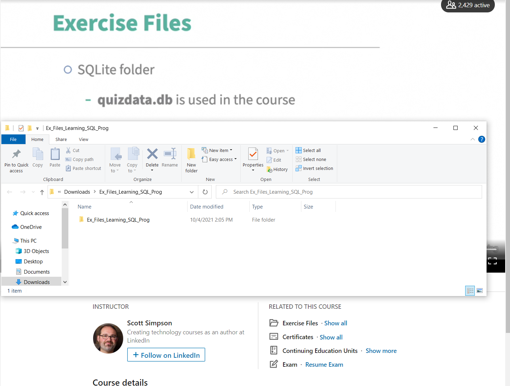

# Introduction to Relational Database and SQL

## Summary
Structured Query Language (SQL) is a common tool for retrieving data from relational databases such as SQL Server, MySQL, MariaDB, and PostgreSQL. This course provides an introduction to managing data held in a relational database management system (RDBMS).

### Topics
- Terms (SQL, Schema, Relational Database, Statement, Clause, Keyword, CRUD, etc.)
- Selecting data
- Joining tables
- Data types
- Basic SQL math operations
- Inserting data
- Updating data
- Deleting data

## Estimate Time
The estimated time is four hours.
- Media 1h 46m
- Practice and set 2h

## Resources
LinkedIn Learning - [Learning SQL Programming](https://www.linkedin.com/learning/learning-sql-programming-8382385/learning-sql-programming)

## Learning SQL Programming 
Follow along with the video.  If Scott writes a query into SQLite, write the same query.  Do each challenge and then watch solution.  Challenges are in chapters 1 - 4. After completing the video, do the exam, but you do not need to retake the exam.

[Learning SQL Programming](https://www.linkedin.com/learning/learning-sql-programming-8382385/learning-sql-programming)

## Introduction

#### Download the exercise files
Scott says you may download these files from GitHub, however, they are also included in the exercise files directory as a zip folder.  Download and unzip the exercise files.  (Be sure to unzip the folder before getting started.)

Use the tools sqlite tools recommended by Scott and the *quizdata.db* file.

#### Download SQLite 

Follow the instructions for downloading [SQLite](https://sqlitebrowser.org/dl/) and opening the excercise file **quizdata.db.**

#### *What is a database?*
> At the most basic, a database is a collection of information.

#### *What is a Schema?*
> The layout and definition of how fields, tables, and relationships are set up is called the schema of the database.

#### *What is a relational database?*
A relational database is a type of database that stores and provides access to data points that are related to one another. A relational database uses tables, each row in the table is a record with a unique ID called the key. The columns of the table hold attributes of the data, and each record usually has a value for each attribute, making it easy to establish the relationships among data points.

#### *What is SQL?*
> Structured Query Language, which is a language for manipulating and defining data in databases.

Some "products" support the SQL standard and add other features on top of it, and some support part, though not all, of the SQL standard. 

#### *What is a SQL statement?*
> Something you write in SQL to get an answer from a database or to make a change to it is called a statement.

#### *What is a clause?*
> A statement is made up of clauses... Clauses are the basic components of statements.

#### *What is a keyword*
> Special or reserved words which tell the database to take some action

#### *What is a field?*
> Columns of data whose values we want to use 

#### *What is a predicates?*
> Specify what information or condition we're looking for. Predicates include a value or condition called an expression.

[Transactional SQL Keywords](https://docs.microsoft.com/en-us/sql/t-sql/language-elements/reserved-keywords-transact-sql?view=sql-server-ver15)

#### *What does CRUD stand for?*
C - Create

R - Read

U - Update

D - Delete

### Ask for data from a database
Follow along with the video.  If Scott writes a query into SQLite, write the same query.

### Ask for Data from Two or More Tables
Follow along with the video.  If Scott writes a query into SQLite, write the same query.

### Data Types, Math, and Helpful Features
Follow along with the video.  If Scott writes a query into SQLite, write the same query.

### Add or Modify Data
Follow along with the video.  If Scott writes a query into SQLite, write the same query. 

### Conclusion
Do the exam, but you do not need to retake the exam.